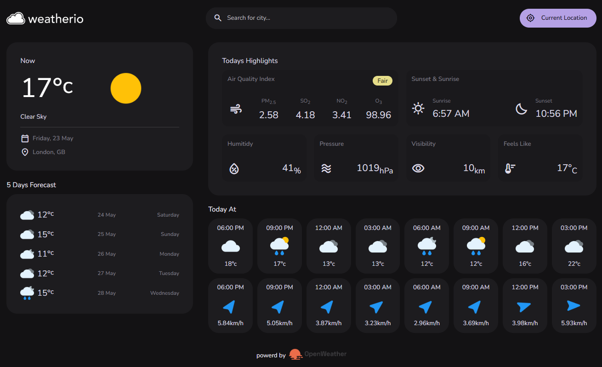

# Real Time Weather App

A modern weather app built with React.js, showing real-time weather updates by city or current location.

### 🌐 Live Demo: [Weather App](https://realt-time-weather-mz.vercel.app/)

## 📸 Preview

## 🧠 Key Concepts

- `useReducer` for state management
- `useGeolocation`, `useFetchData` custom hooks for implementing reusable logic
- `AbortController` Prevented outdated search requests from updating state, improving performance and preventing race conditions.

## ⚠️ Limitations

- **Prop Drilling:** Some components rely on deep prop passing; could benefit from context or state management libraries like Redux or Zustand in the future.
